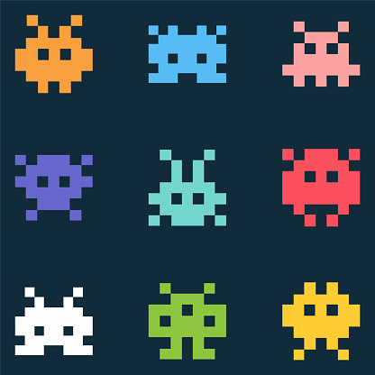

.. MoodServer documentation master file, created by
   sphinx-quickstart on Sun May 28 15:42:17 2023.
   You can adapt this file completely to your liking, but it should at least
   contain the root `toctree` directive.

Welcome to MoodServer's documentation!
======================================

   +------------------------------+
   |          Задача № Mood       |
   |                              |
   +------------------------------+

   - Клонирование, создание виртуального окружения и автоматическое создание wheel-пакетов
   - Должно получиться минимум два wheel-пакета:
   - Пакет с клиентом (содержит всё необходимое для работы сервера, не содержит клиентской части)
   - Пакет с сервером (содержит всё необходимо для работы клиента, не содержит серверной части)
   - Допустимо дублирование некоторых файлов в пакетах или выделение общей части в третий пакет
   - Установка из пакетов с помощью pip install двух клиентов и сервера в три чистых виртуальных окружения

.. toctree::
   :maxdepth: 2
   :caption: Contents:

   modules

Indices and tables
==================

* :ref:`genindex`
* :ref:`modindex`
* :ref:`search`
